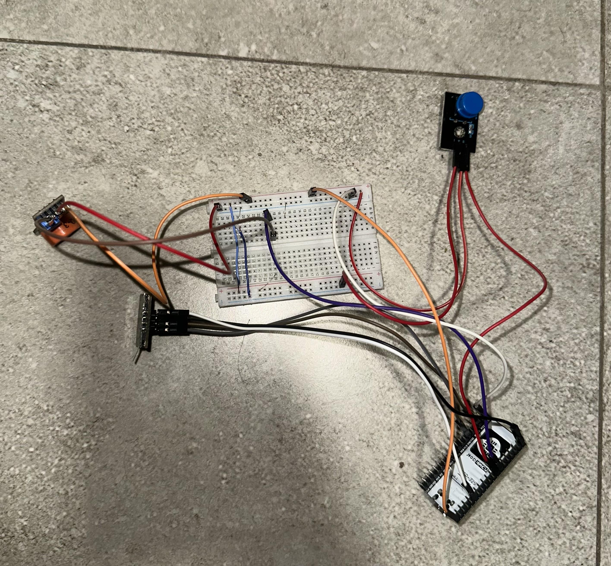
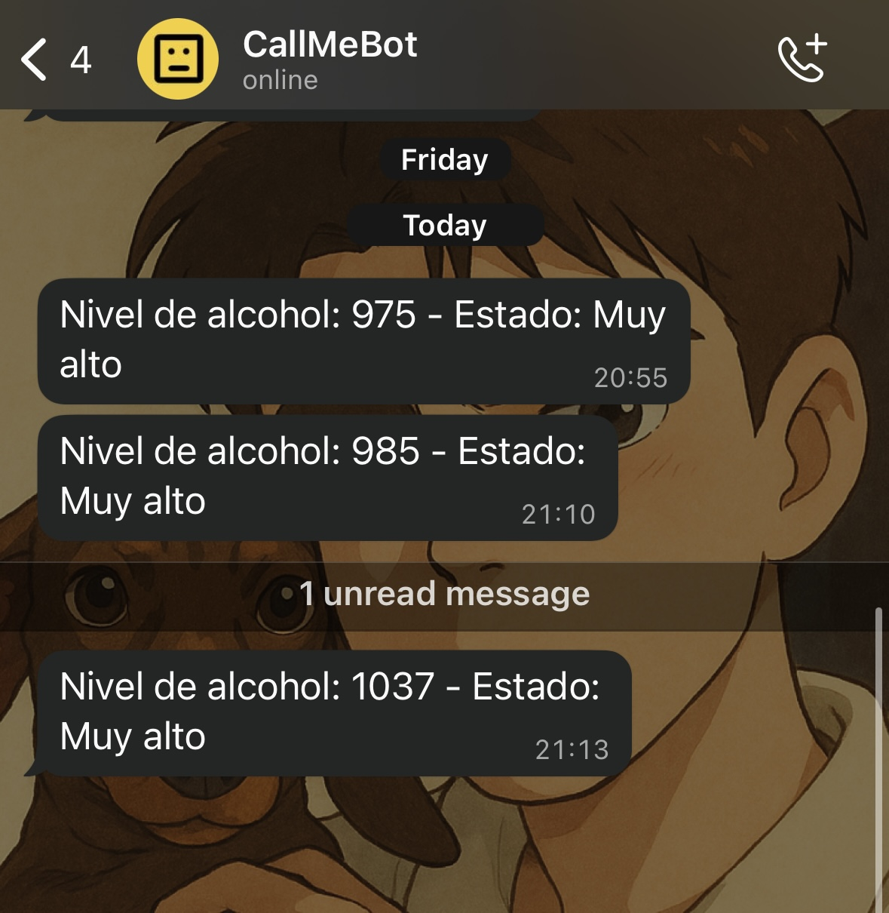

# Sensor de Alcohol con ESP32 + WhatsApp + Pantalla OLED

Este proyecto consiste en el desarrollo de un prototipo funcional (MVP) de un dispositivo portátil que mide el nivel de alcohol en el aliento y envía los resultados por WhatsApp. Utiliza un ESP32, un sensor MQ-3 y una pantalla OLED SSD1306 para ofrecer una experiencia simple, directa y accesible para cualquier usuario.

### 🔹 Características principales

* Lectura del nivel de alcohol mediante el sensor MQ-3.
* Flujo guiado por pantalla OLED que muestra mensajes al usuario en cada etapa.
* Envió automático del resultado vía WhatsApp usando la API de CallMeBot.
* Clasificación inteligente del nivel de alcohol en 4 categorías: **Normal**, **Límite**, **Alto** y **Muy alto**.
* Interacción sencilla: presionar un botón, soplar y recibir el resultado.

### 💻 Tecnologías utilizadas

* **ESP32** como microcontrolador principal.
* **Sensor MQ-3** para detección de alcohol.
* **Pantalla OLED SSD1306** para interfaz visual.
* **Lenguaje C++** con el entorno de desarrollo Arduino IDE.
* **WiFi** para conectar a Internet y usar la API.
* **API de CallMeBot** para el envío de mensajes por WhatsApp.

### 🔄 Flujo del dispositivo

1. El usuario enciende el dispositivo.
2. En pantalla se muestra “Presione el botón y sople”.
3. Al presionar, se inicia una cuenta regresiva mientras el usuario sopla.
4. Se toma la lectura del sensor.
5. Se clasifica el resultado y se genera el mensaje.
6. El mensaje es enviado por WhatsApp.
7. El sistema se reinicia esperando una nueva lectura.

### 📅 Estado del proyecto

Actualmente en versión MVP. Futuras mejoras podrían incluir:

* Registro de datos en base de datos o en la nube.
* Visualización gráfica de las mediciones.
* Aplicación web o móvil de acompañamiento.
* Integración con modelos de IA para detectar patrones de consumo.

---

### ✅ Ideal para:

* Uso personal en reuniones sociales.
* Concientización sobre consumo responsable.
* Proyectos de IoT y educación técnica.

> Si querés colaborar, hacer mejoras o dar ideas para la versión comercial, abrí un issue o enviá un pull request.

---

**Desarrollado por:** Tomás Jesús Zapani

